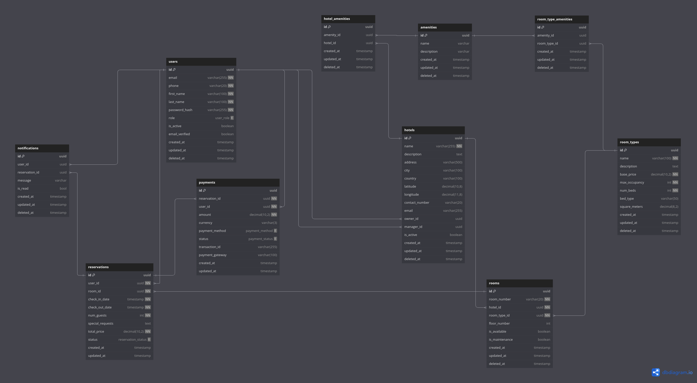

# Database Schema

## Overview
The hotel reservation system uses PostgreSQL as its primary database. Below is the detailed schema design with table structures and relationships.

## Entity Relationship Diagram


## Tables

### users
```sql
CREATE TABLE users (
    id UUID PRIMARY KEY DEFAULT gen_random_uuid(),
    email VARCHAR(255) UNIQUE NOT NULL,
    password_hash VARCHAR(255) NOT NULL,
    first_name VARCHAR(100) NOT NULL,
    last_name VARCHAR(100) NOT NULL,
    phone VARCHAR(20),
    created_at TIMESTAMP WITH TIME ZONE DEFAULT CURRENT_TIMESTAMP,
    updated_at TIMESTAMP WITH TIME ZONE DEFAULT CURRENT_TIMESTAMP,
    last_login TIMESTAMP WITH TIME ZONE,
    status VARCHAR(20) DEFAULT 'ACTIVE'
);
```

### room_types
```sql
CREATE TABLE room_types (
    id UUID PRIMARY KEY DEFAULT gen_random_uuid(),
    name VARCHAR(50) NOT NULL,
    description TEXT,
    base_price DECIMAL(10,2) NOT NULL,
    max_occupancy INTEGER NOT NULL,
    created_at TIMESTAMP WITH TIME ZONE DEFAULT CURRENT_TIMESTAMP,
    updated_at TIMESTAMP WITH TIME ZONE DEFAULT CURRENT_TIMESTAMP
);
```

### rooms
```sql
CREATE TABLE rooms (
    id UUID PRIMARY KEY DEFAULT gen_random_uuid(),
    room_number VARCHAR(10) UNIQUE NOT NULL,
    room_type_id UUID REFERENCES room_types(id),
    floor INTEGER NOT NULL,
    status VARCHAR(20) DEFAULT 'AVAILABLE',
    created_at TIMESTAMP WITH TIME ZONE DEFAULT CURRENT_TIMESTAMP,
    updated_at TIMESTAMP WITH TIME ZONE DEFAULT CURRENT_TIMESTAMP
);
```

### bookings
```sql
CREATE TABLE bookings (
    id UUID PRIMARY KEY DEFAULT gen_random_uuid(),
    user_id UUID REFERENCES users(id),
    room_id UUID REFERENCES rooms(id),
    check_in_date DATE NOT NULL,
    check_out_date DATE NOT NULL,
    total_amount DECIMAL(10,2) NOT NULL,
    status VARCHAR(20) DEFAULT 'PENDING',
    created_at TIMESTAMP WITH TIME ZONE DEFAULT CURRENT_TIMESTAMP,
    updated_at TIMESTAMP WITH TIME ZONE DEFAULT CURRENT_TIMESTAMP,
    CONSTRAINT valid_dates CHECK (check_out_date > check_in_date)
);
```

### payments
```sql
CREATE TABLE payments (
    id UUID PRIMARY KEY DEFAULT gen_random_uuid(),
    booking_id UUID REFERENCES bookings(id),
    amount DECIMAL(10,2) NOT NULL,
    payment_method VARCHAR(50) NOT NULL,
    status VARCHAR(20) DEFAULT 'PENDING',
    transaction_id VARCHAR(255),
    created_at TIMESTAMP WITH TIME ZONE DEFAULT CURRENT_TIMESTAMP,
    updated_at TIMESTAMP WITH TIME ZONE DEFAULT CURRENT_TIMESTAMP
);
```

### room_amenities
```sql
CREATE TABLE room_amenities (
    id UUID PRIMARY KEY DEFAULT gen_random_uuid(),
    room_type_id UUID REFERENCES room_types(id),
    name VARCHAR(100) NOT NULL,
    description TEXT,
    created_at TIMESTAMP WITH TIME ZONE DEFAULT CURRENT_TIMESTAMP
);
```

### notifications
```sql
CREATE TABLE notifications (
    id UUID PRIMARY KEY DEFAULT gen_random_uuid(),
    user_id UUID REFERENCES users(id),
    booking_id UUID REFERENCES bookings(id),
    type VARCHAR(50) NOT NULL,
    message TEXT NOT NULL,
    status VARCHAR(20) DEFAULT 'PENDING',
    created_at TIMESTAMP WITH TIME ZONE DEFAULT CURRENT_TIMESTAMP,
    sent_at TIMESTAMP WITH TIME ZONE
);
```

## Indexes

```sql
-- Users
CREATE INDEX idx_users_email ON users(email);

-- Rooms
CREATE INDEX idx_rooms_room_type ON rooms(room_type_id);
CREATE INDEX idx_rooms_status ON rooms(status);

-- Bookings
CREATE INDEX idx_bookings_user ON bookings(user_id);
CREATE INDEX idx_bookings_room ON bookings(room_id);
CREATE INDEX idx_bookings_dates ON bookings(check_in_date, check_out_date);
CREATE INDEX idx_bookings_status ON bookings(status);

-- Payments
CREATE INDEX idx_payments_booking ON payments(booking_id);
CREATE INDEX idx_payments_status ON payments(status);

-- Notifications
CREATE INDEX idx_notifications_user ON notifications(user_id);
CREATE INDEX idx_notifications_status ON notifications(status);
```

## Views

### room_availability_view
```sql
CREATE VIEW room_availability_view AS
SELECT 
    r.id AS room_id,
    r.room_number,
    rt.name AS room_type,
    rt.base_price,
    r.status,
    b.check_in_date,
    b.check_out_date
FROM rooms r
LEFT JOIN room_types rt ON r.room_type_id = rt.id
LEFT JOIN bookings b ON r.id = b.room_id
WHERE b.status != 'CANCELLED' OR b.status IS NULL;
```

## Functions

### check_room_availability
```sql
CREATE OR REPLACE FUNCTION check_room_availability(
    p_check_in_date DATE,
    p_check_out_date DATE,
    p_room_type_id UUID
) RETURNS TABLE (
    room_id UUID,
    room_number VARCHAR,
    base_price DECIMAL
) AS $$
BEGIN
    RETURN QUERY
    SELECT 
        r.id,
        r.room_number,
        rt.base_price
    FROM rooms r
    JOIN room_types rt ON r.room_type_id = rt.id
    WHERE r.room_type_id = p_room_type_id
    AND r.id NOT IN (
        SELECT room_id 
        FROM bookings 
        WHERE status != 'CANCELLED'
        AND (check_in_date, check_out_date) OVERLAPS (p_check_in_date, p_check_out_date)
    );
END;
$$ LANGUAGE plpgsql;